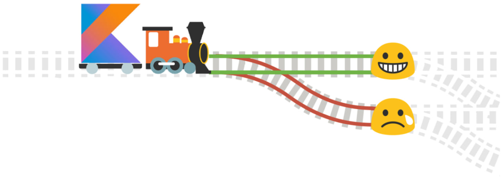

# ROP: Railway Oriented Programming

**نگارندگان:**

مهدی علی‌نژاد، امیرحسین شهیدی و سعید فراتی کاشانی
## مقدمه

تصور کنید در یک EndPoint درخواستی را ارسال می‌کنید و این درخواست شامل مراحل زیر است:

```
Receive request -> Validate and canonicalize request -> Run use case and logic -> Database functions and save state -> Return result to user
```

چه تضمینی وجود دارد که برنامه در هر یک از این قسمت‌ها دچار مشکل نشود؟ آیا با وجود قراردادهایی که بین تیم‌های توسعه دهنده و استفاده‌کننده‌ی سرویس‌ها وجود دارد، می‌توان 100 درصد صحت داده‌های ورودی را تضمین کرد؟ آیا تیم توسعه دهنده می‌تواند تضمین دهد که تمام مراحل اجرای یک درخواست با صحت کامل انجام می‌شود؟

در دنیای واقعی نرم‌افزار، ما هیچ‌وقت همیشه در Happy Path (مسیری بدون ایراد) حرکت نمی‌کنیم. ورودی‌هایی که از سمت کاربر دریافت می‌کنیم، همیشه کامل و درست نیستند؛ ممکن است داده‌ها ناقص، نادرست یا ناسازگار باشند. حتی در تعامل با سرویس‌ها و APIهای خارجی، احتمال خطا وجود دارد؛ از خطای شبکه گرفته تا پاسخ‌های غیرمنتظره. اگر این خطاها بدون کنترل وارد لایه‌ی Use Case و منطق اصلی برنامه شوند، به‌سرعت تبدیل به Exceptionهای ناخواسته می‌شوند و سیستم را در همان لحظه یا در ارجاعات بعدی دچار اختلال می‌کنند.

از طرف دیگر، فقط جلوگیری از خطا کافی نیست. ما نیاز داریم این ایرادها را به شکل مناسب و قابل فهم به بیرون منتقل کنیم؛ چه به سمت کاربر نهایی، چه به ماژول دیگری در سیستم. کاربر یا بخش مصرف‌کننده باید بتواند بدون نیاز به بررسی لاگ‌ها، بداند چه اتفاقی افتاده و چرا نتیجه مورد انتظار برنگشته است.

اینجاست که در Functional Programming مفهومی به نام **Railway Oriented Programming (ROP)** وارد می‌شود. ROP با الهام از خطوط ریلی، جریان اجرای کد را به دو مسیر موفقیت و شکست تقسیم می‌کند. هر عملیات می‌تواند روی هر یک از این ریل‌ها قرار بگیرد و مهم‌ترین نکته این است که اگر خطایی رخ دهد، برنامه بدون پرتاب Exception و بدون شکست کلی جریان، به مسیر خطا هدایت می‌شود.

### مزایای ROP

* **مدیریت درست خطاها**: خطاها بخشی از جریان عادی برنامه می‌شوند نه استثناهای ناخواسته.
* **خوانایی و سادگی بیشتر**: منطق اصلی برنامه فقط در مسیر موفقیت نوشته می‌شود و کدهای مربوط به خطا به‌طور طبیعی از آن جدا هستند.
* **قابل پیش‌بینی بودن رفتار**: توسعه‌دهنده دقیقاً می‌داند در صورت بروز خطا چه اتفاقی می‌افتد و چه داده‌ای برگردانده می‌شود.
* **افزایش قابلیت تست و نگهداری**: چون خطاها به شکل داده مدل می‌شوند، تست آن‌ها آسان‌تر و سیستم پایدارتر خواهد بود.

به زبان ساده، ROP به ما کمک می‌کند با نگاهی سیستماتیک و شفاف به مدیریت خطاها، نرم‌افزاری پایدارتر، خواناتر و کاربرپسند طراحی کنیم.

---

## ساده‌ترین روش مدیریت خطا

نمونه کد زیر را در نظر بگیرید:

```kotlin
fun updateCustomer(): String {
    val request = receiveRequest()
    val validationErrors = validateRequest(request)

    if (validationErrors.isNotEmpty()) {
        return "Invalid request: " + validationErrors.joinToString(", ")
    }

    request.email = canonicalizeEmail(request.email)

    try {
        val updated = customerRepo.updateFromRequest(request)
        if (!updated) {
            return "Customer record not found"
        }
    } catch (ex: Exception) {
        return "DB error: " + ex.message
    }

    if (!smtpServer.sendEmail(request.email)) {
        logger.error("Customer email not sent for ${request.email}")
    }

    return "Success"
}
```

### ایرادهای این کد

1. **تجمیع چندین مسئولیت در یک تابع**

   * تمام مراحل: دریافت ورودی، اعتبارسنجی، نرمال‌سازی، دسترسی به دیتابیس، فراخوانی سرویس خارجی، لاگینگ همه در یک تابع.
   * پیامدها: تست‌پذیری پایین، تغییرپذیری سخت، خوانایی پایین.

2. **کانال‌های ناهمگون برای خطا**

   * اعتبارسنجی: List<String>
   * NotFound در DB: Bool
   * اشتباهات DB: Exception
   * اشتباه SMTP: فقط لاگ

3. **خطاهای تایپ String**

   * رشته‌ها قابل‌ماشین‌خوانی نیستند.
   * بومی‌سازی و گزارش‌دهی دشوار.

4. **قورت دادن Exception و از دست دادن Trace و نوع خطا**

   * Catch Exception کلی است و Trace از بین می‌رود.

5. **نداشتن Atomicity و بروز Side Effect**

   * دیتابیس آپدیت می‌شود، ایمیل ممکن است ارسال نشود.

6. **فقدان سیاست‌های پایداری برای سرویس‌های خارجی**

   * Retry/Backoff/Timeout/ Circuit Breaker وجود ندارد.

7. **لاگ‌نویسی ناکافی و غیرساخت‌یافته**

   * فقط یک لاگ برای شکست ایمیل، جریان برنامه ردیابی نمی‌شود.

---

## راه‌حل‌ها: Composition Everywhere

* **کاهش پیچیدگی ذهنی**
* **تست‌پذیری بهتر**
* **انعطاف‌پذیری و تغییر آسان**
* **قابلیت ترکیب‌پذیری**
* **تفکیک مسئولیت‌ها**

### لایه‌ها

1. **لایه ورودی (Controller/Adapter)**
2. **لایه اعتبارسنجی (Validation)**
3. **لایه منطق برنامه (Use Case / Application Service)**
4. **لایه دامنه (Domain)**
5. **لایه زیرساخت (Infrastructure)**
6. **لایه بازخورد (Presenter/Response Builder)**

---

## استفاده از ResultType در مدیریت خطاها

```kotlin
sealed class Result\<out T, out E> {
    data class Success<T>(val value: T) : Result\<T, Nothing>()
    data class Error<E>(val error: E) : Result\<Nothing, E>()
}
```

### مثال اعتبارسنجی ورودی

```kotlin
fun validateInput(input: UserInput): Result\<UserInput, String> {
    return when {
    input.name.isEmpty() -> Result.Error("Name must not be blank")
    input.email.isEmpty() -> Result.Error("Email must not be blank")
    else -> Result.Success(input)
    }
}
```

---

## مدل‌سازی خطاهای ساخت‌یافته

```kotlin
public final data class Failure(
    val timestamp: Instant,
    val category: Failure.Category,
    val code: String,
    val docUrl: String?,
    val description: String?,
    val values: List<Any>,
    val causes: MutableList<Failure>
)
```

### مزایا

* **Timestamp:** زمان رخداد خطا
* **Category:** نوع خطا
* **Code:** شناسه یکتا
* **DocUrl:** لینک مستندات
* **Description:** توضیح انسانی
* **Values:** داده‌های مرتبط با خطا
* **Causes:** علت‌های زنجیره‌ای

---

## ملاحظات در طراحی ROP

1. **مرزبندی روشن بین «خطای دامنه» و «خطای فنی»**
2. **یک‌دست بودن قرارداد خروجی: همه توابع Result\<T, Failure>**
3. **مدل‌سازی خطاهای قابل‌پیش‌بینی**

---

## جدا کردن وظایف (Separation of Concerns)

* اعتبارسنجی فقط قوانین ورودی را بررسی کند.
* لایه دامنه فقط منطق کسب‌وکار را اجرا کند.
* زیرساخت فقط مسئول تعامل با DB/ایمیل باشد.

---

## مدیریت استثناها (Exception Handling)

* استثناهای قابل‌پیش‌بینی → تبدیل به Failure
* استثناهای غیرمنتظره → Fail Fast

---

## ترکیب توابع و خط لوله ROP

* توابع اعتبارسنجی → دو مسیر success/failure
* توابع خالص → فقط مسیر موفقیت
* توابع زیرساختی → ممکن است dead end داشته باشند
* توابع استثنازا → استثناهای قابل پیش‌بینی → Failure

---

## لایه آخر: تبدیل به خروجی قابل مصرف

```kotlin
call.respondResult(response, HttpStatusCode.OK, {
    when (it) {
        is StartPaymentFailure.FailedToRequestIdentifier -> HttpStatusCode.InternalServerError
        is StartPaymentFailure.InvalidParams -> HttpStatusCode.BadRequest
        is StartPaymentFailure.PcPosAccountNotFound -> HttpStatusCode.NotFound
        is StartPaymentFailure.PcPosIdentifierNotFound -> HttpStatusCode.BadRequest
    }
    }) {
    PcPoseHttpResponse.fromDto(it)
}
```

### تابع تبدیل خطا به خروجی

```kotlin
@Serializable
data class FailureHttpResponse(
val timestamp: String,
val traceId: String,
val category: String,
val code: String,
val message: String,
val description: String?,
val docUrl: String?,
val details: List<Detail> = listOf(),
) {

@Serializable
data class Detail(
    val field: String?,
    val value: String?,
    val message: String,
    val docUrl: String?,
)

companion object {
    fun fromResultError(failure: Failure) = FailureHttpResponse(
        timestamp = failure.timestamp.toString(),
        traceId = ContextHolder.getTraceId(),
        category = failure.category.name,
        code = failure.code,
        message = Localization.getMessage(
            failure.code,
            failure.values,
            ContextHolder.getUserInfo().locale,
            Locale.ENGLISH
        ),
        description = failure.description,
        docUrl = failure.docUrl,
        details = failure.causes.map {
            Detail(
                field = null,
                value = null,
                message = Localization.getMessage(
                    it.code,
                    it.values,
                    ContextHolder.getUserInfo().locale,
                    Locale.ENGLISH
                ),
                docUrl = null,
            )
        },
    )
}

}
```

---

## جمع‌بندی

Railway Oriented Programming یک رویکرد سیستماتیک برای مدیریت خطاها ارائه می‌دهد:

* **Composition Everywhere** → اجزای کوچک و مستقل
* **Result Type** → مسیر مشخص success/failure
* **Failure class** → خطاهای ساخت‌یافته و قابل ترکیب
* **Pipeline ROP** → جریان موفقیت و شکست شفاف
* **Response mapping** → خروجی قابل فهم و قابل ردیابی

این روش باعث **پایداری، خوانایی، تست‌پذیری و قابلیت نگهداری بالا** در سیستم‌های بزرگ می‌شود.

---
## منابع

* [swlaschin/RailwayOrientedProgramming](https://github.com/swlaschin/RailwayOrientedProgramming)
* [Scott Wlaschin Railway oriented programming](https://assets.ctfassets.net/oxjq45e8ilak/7xK0qHVPg6utOuOYbnwdNG/632e0996fd81442642b71d9f9e33fc35/Scott_Wlaschin_Railway_oriented_programming_2021_03_27_02_15_18.pdf)
