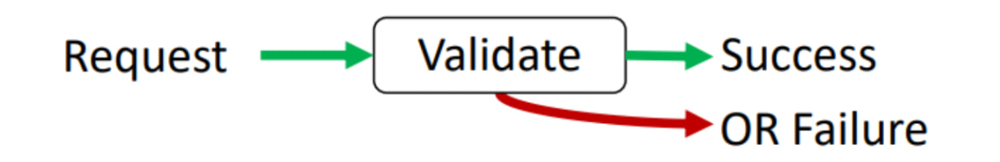
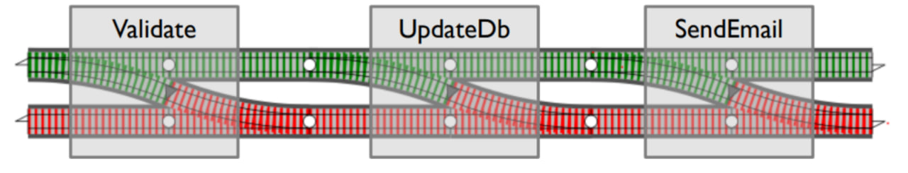
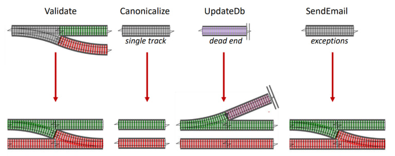

# ROP: Railway Oriented Programming

**نگارندگان:**

مهدی علی‌نژاد، امیرحسین شهیدی و سعید فراتی کاشانی

# مقدمه

تصور کنید در یک EndPoint درخواستی را ارسال می‌کنید و این درخواست شامل مراحل زیر است:

Receive request \-\> Validate and canonicalize request \-\> Run use case and logic \-\> Database functions and save state \-\> Return result to user 

چه تضمینی وجود دارد که برنامه در هر یک از این قسمت‌ها دچار مشکل نشود؟ آیا با وجود قراردادهایی که بین تیم‌های توسعه دهنده و استفاده کنندۀ سرویس‌ها وجود دارد، می‌توان 100 درصد صحت داده‌های ورودی را تضمین کرد؟ آیا تیم توسعه دهنده می‌تواند تضمین دهد که تمام مراحل اجرای یک درخواست با صحت کامل انجام می‌شود؟

در دنیای واقعی نرم‌افزار، ما هیچ‌وقت همیشه در **Happy Path (مسیری بدون ایراد)** حرکت نمی‌کنیم. ورودی‌هایی که از سمت کاربر دریافت می‌کنیم، همیشه کامل و درست نیستند؛ ممکن است داده‌ها ناقص، نادرست یا ناسازگار باشند. حتی در تعامل با سرویس‌ها و APIهای خارجی، احتمال خطا وجود دارد؛ از خطای شبکه گرفته تا پاسخ‌های غیرمنتظره. اگر این خطاها بدون کنترل وارد لایه‌ی **Use Case** و منطق اصلی برنامه شوند، به‌سرعت تبدیل به **Exception**‌های ناخواسته می‌شوند و سیستم را در همان لحظه یا در ارجاعات بعدی دچار اختلال می‌کنند.

از طرف دیگر، فقط جلوگیری از خطا کافی نیست. ما نیاز داریم این ایرادها را به شکل مناسب و قابل فهم به بیرون منتقل کنیم؛ چه به سمت کاربر نهایی، چه به ماژول دیگری در سیستم. کاربر یا بخش مصرف‌کننده باید بتواند بدون نیاز به بررسی لاگ‌ها، بداند چه اتفاقی افتاده و چرا نتیجه مورد انتظار برنگشته است.

اینجاست که در **Functional Programming** مفهومی به نام **Railway Oriented Programming (ROP)** وارد می‌شود. ROP با الهام از خطوط ریلی، جریان اجرای کد را به دو مسیر **موفقیت** و **شکست** تقسیم می‌کند. هر عملیات می‌تواند روی هر یک از این ریل‌ها قرار بگیرد و مهم‌ترین نکته این است که اگر خطایی رخ دهد، برنامه بدون پرتاب Exception و بدون شکست کلی جریان، به مسیر خطا هدایت می‌شود.

**این رویکرد چند مزیت اساسی دارد:**

* **مدیریت درست خطاها**: خطاها بخشی از جریان عادی برنامه می‌شوند نه استثناهای ناخواسته.  
* **خوانایی و سادگی بیشتر**: منطق اصلی برنامه فقط در مسیر موفقیت نوشته می‌شود و کدهای مربوط به خطا به‌طور طبیعی از آن جدا هستند.  
* **قابل پیش‌بینی بودن رفتار**: توسعه‌دهنده دقیقاً می‌داند در صورت بروز خطا چه اتفاقی می‌افتد و چه داده‌ای برگردانده می‌شود.  
* **افزایش قابلیت تست و نگهداری**: چون خطاها به شکل داده مدل می‌شوند، تست آن‌ها آسان‌تر و سیستم پایدارتر خواهد بود.

به زبان ساده، ROP به ما کمک می‌کند با نگاهی سیستماتیک و شفاف به مدیریت خطاها، نرم‌افزاری پایدارتر، خواناتر و کاربر پسندتر طراحی کنیم.

# ساده‌ترین روش مدیریت خطا

به عنوان اولین و ساده‌ترین راه برای مدیریت خطا در روند اجرای یک درخواست نمونۀ زیر را بررسی می‌کنیم:
```kotlin
fun updateCustomer(): String {
    val request = receiveRequest()
    val validationErrors = validateRequest(request)
    
    if (validationErrors.isNotEmpty()) {
        return "Invalid request: " + validationErrors.joinToString(", ")
    }

    request.email = canonicalizeEmail(request.email)

    try {
        val updated = customerRepo.updateFromRequest(request)
        if (!updated) {
            return "Customer record not found"
        }
    } catch (ex: Exception) {
        return "DB error: " + ex.message
    }

    if (!smtpServer.sendEmail(request.email)) {
        logger.error("Customer email not sent for ${request.email}")
    }
    
    return "Success"
}
```
اکنون به بررسی ایرادهای این کد می‌پردازیم:

1. **تجمیع چندین مسئولیت در یک تابع و نقض اصل تک مسئولیتی (Violation of SRP)**

تمامی روند اجرای این درخواست در یک تابع جمع شده و اجرا می‌شود؛ دریافت ورودی، اعتبارسنجی، نرمال‌سازی/تبدیل، دسترسی به دیتابیس، فراخوانی سرویس خارجی (SMTP)، و لاگ کردن همه در یک تابع انجام شده است.  
**پیامدها:**  
**تست‌پذیری پایین**: عملا امکان تست اجزای مختلف برنامه وجود ندارد و برای تست باید کل یک درخواست را تست کرد و تمامی وابستگی‌ها را Mock کرد.  
**تغییرپذیری سخت**: هر تغییر کوچک در هر مرحله باعث تغییر همین تابع می‌شود (Shotgun Surgery).  
**خوانایی و تمرکز پایین**: منطق دامنه (Use Case) با جزئیات زیرساخت (Infrastructure) قاطی شده است.

2. **کانال‌های ناهمگون برای خطا**

**اعتبارسنجی**: با یک پیام و یک لیست از خطاهای رخ داده است. (List\<String\>)  
**NotFound در DB**: با یک bool ساده مدل شده است.  
**اشتباهات DB**: با Exception گرفته شده و به متن تبدیل می‌شود.  
**اشتباه SMTP**: اصلاً به خروجی برنمی‌گردد، فقط لاگ می‌شود؛ ولی تابع Success خروجی می‌دهد\!  
**پیامدها:**  
مصرف‌کننده‌ی تابع رفتار یکنواختی نمی‌بیند؛ بعضی خطاها «وضعیت» خروجی را تغییر می‌دهند، بعضی‌ها فقط در لاگ هستند، بعضی با Exception هندل می‌شوند.  
این مورد باعث می‌شود افرادی که از این سرویس استفاده می‌کنند، یک رفتار یکنواخت در خروجی مشاهده نکنند.

3. **خطاهای تایپ String**

در حال حاضر ما عملا خطاها را صرفا به صورت یک رشته ارسال می‌کنیم. این اتفاق باعث می‌شود کاربر ابرداده (Meta data) و اطلاعات بیشتر از یک خطا را نداشته باشد. این ابرداده علی الخصوص در خطاهای سمت سرور و خطاها سرویس‌های بیرونی بسیار لازم و مفید هستند و از طرفی پیام‌های متنی، قرارداد نیستند.  
**پیامدها:**  
برای ماشین/کاربر (Client) غیرقابل‌مصرف است (نمی‌شود براساس نوع خطا تصمیم گرفت).  
بومی‌سازی/ترجمه سخت می‌شود (متن انگلیسی/فارسی در منطق\!)  
گزارش و مانیتورینگ مبتنی بر کد خطا امکان‌پذیر نیست.

4.  قورت دادن Exception و از دست دادن Trace و نوع خطا

در این روش Catch Exception بسیار کلی است و نوع دقیق استثنا را مشخص نمی‌کند. همچنین ما در استثناها علاقه داریم تا Trace این استثنا را لاگ کنیم تا بهتر دلیل استثناهای سیستم را شناسایی و رفع کنیم.   
**پیامد:**  
**دیباگ سخت**: ما اینجا با یک مسیج خروجی و بدون لاگ کردن امکان رفع مشکل بدون دیباگ محلی (Local Debug) عملا ممکن نیست.

5. **نداشتن Atomicity در برنامه و بروز Side Effect**

دیتابیس آپدیت می‌شود، ولی ایمیل ممکن است ارسال نشود. تابع با وجود شکست ایمیل، Success برمی‌گرداند.  
**پیامد:**  
حالت‌های «Partial Success» به‌وجود می‌آید.  
اگر واقعاً ایمیل بخشی از «تعهد» Use Case است، باید یا Transaction/Saga/Compensation داشته باشیم، یا شکست ایمیل را به خروجی منعکس کنیم.

**6\. فقدان سیاست‌های پایداری برای سرویس‌های خارجی**  
برای SMTP Retry/Backoff/Timeout/ Circuit Breaker نداریم و عملا بدون یک فرآیند کامل و مشخص از ارسال یک درخواست به سرویس خارجی، عملاً با این سرویس به شکل یک تابع داخلی برخورد شده است؛ در حالی که سرویس‌های خارجی شرایط و پیش‌نیازهای خاص خود را دارند.  
**پیامد:**  
با یک اختلال موقتی، تجربه‌ی کاربر بد یا وضعیت ناسازگار ایجاد می‌شود.  
**7\. لاگ‌نویسی ناکافی و غیرساخت‌یافته**

فقط یک لاگ برای شکست ایمیل داریم؛ اطلاعاتی درمورد اینکه هر بخش برنامه چطور انجام شده و با چه ورودی‌هایی منطق برنامه اجرا شده و چه زمانی وارد هر بخش از برنامه می‌شویم لاگ نشده است.  
**پیامد:**  
ردیابی جریان و تحلیل رخدادها سخت می‌شود و رفع باگ‌های سیستم سخت می‌شود.  
رویکردی که خطا را هرجا به‌شکلی متفاوت مدیریت می‌کند—جایی با بولین، جایی با اکسپشن، جایی فقط با لاگ—در مقیاس سازمانی عملاً بی‌ساختار و مضر است. چون همه‌چیز در یک نقطه انباشته می‌شود (ورود، اعتبارسنجی، منطق دامنه، دیتابیس، سرویس خارجی)، کد نه قابل‌خواندن است، نه قابل‌تست، و با هر تغییر کوچک فرو می‌ریزد. ناهمگونی کانال‌های خطا باعث می‌شود قرارداد بین ماژول‌ها مبهم شود: بخشی خطا را به خروجی می‌فرستد، بخشی در لاگ دفن می‌کند، بخشی هم با اکسپشن جریان را می‌شکند. از آن بدتر، خطاها «متنی» و فاقد نوع و کد هستند؛ بنابراین نه می‌توان تصمیم ماشینی گرفت، نه می‌توان به‌درستی برای کاربر پیام مناسب ساخت، و نه می‌توان مانیتورینگ معنادار داشت.  
اما راه حل چیست؟  
گام به گام راه‌حل هر مشکل را در ادامه بررسی می‌کنیم.

# Composition everywhere (جدا کردن اجزای مختلف برنامه)

 
در برنامه‌نویسی، مفهوم Composition به معنی ساختن سیستم‌های پیچیده از کنار هم گذاشتن بخش‌های کوچک‌تر و مستقل است. به‌جای اینکه همه‌ی منطق و جزئیات در یک تابع یا کلاس بزرگ ریخته شود، هر بخش کار مشخصی انجام می‌دهد و در نهایت این بخش‌ها مثل پازل کنار هم قرار می‌گیرند.

این اصل، برخلاف Monolithic Thinking است که همه‌چیز را در یک محل متمرکز می‌کند. با Composition Everywhere، برنامه به اجزای کوچک، قابل‌فهم و قابل‌آزمایش تقسیم می‌شود و توسعه‌دهنده می‌تواند راحت‌تر آن‌ها را نگه‌داری یا جایگزین کند.

## چرا ضروری است و چه نفع‌هایی دارد؟

**کاهش پیچیدگی ذهنی:** به‌جای کار با یک تابع ۲۰۰ خطی، با توابع کوچک‌تر و قابل‌فهم‌تر سروکار داریم.  
**تست‌پذیری بهتر:** هر بخش را می‌توان جداگانه تست کرد، بدون نیاز به شبیه‌سازی کل سیستم.  
**انعطاف‌پذیری و تغییر آسان:** وقتی سرویس خارجی تغییر کند، فقط لایه‌ی مربوطه تغییر می‌کند، نه کل منطق برنامه.  
**قابلیت ترکیب‌پذیری:** بخش‌ها را می‌توان در سناریوهای دیگر هم استفاده کرد، بدون بازنویسی.  
**تفکیک مسئولیت‌ها (Separation of Concerns):** اعتبارسنجی، منطق کسب‌وکار، و زیرساخت هرکدام جای مشخص دارند.

## چطور باید برنامه را شکست؟

یک الگوی رایج این است که برنامه را به لایه‌ها تقسیم کنیم (بسته به نیاز سیستم، ممکن است بعضی لایه‌ها ادغام یا ساده‌تر شوند):  
**لایه ورودی (Controller/Adapter):** درخواست را از بیرون می‌گیرد (HTTP, Message Queue, CLI).  
**لایه اعتبارسنجی (Validation):** صحت داده‌ها و قوانین اولیه را بررسی می‌کند.  
**لایه منطق برنامه (Use Case / Application Service):** جریان اصلی کار (مثلاً «به‌روزرسانی مشتری») را تعریف می‌کند. این لایه نباید جزئیات دیتابیس یا ایمیل را بداند اما هر بخش را صدا می‌زند و روند هر منطق را اجرا می‌کند.  
**لایه دامنه (Domain):** قوانین اصلی کسب‌وکار، موجودیت‌ها و Value Objectها.  
**لایه زیرساخت (Infrastructure):** دیتابیس، ایمیل، APIهای خارجی. این‌ها از طریق اینترفیس در اختیار لایه‌ی منطق برنامه قرار می‌گیرند.  
**لایه بازخورد (Presenter/Response Builder)**: خروجی نهایی را برای کاربر یا کلاینت آماده می‌کند (مثلاً JSON، متن یا UI Message).

## ارتباط با ROP

در Railway Oriented Programming، Composition پایه و اساس است. هر مرحله یک «ریل» کوچک است: یا موفق می‌شود و خروجی‌اش به مرحله‌ی بعد می‌رود، یا خطا تولید می‌کند و برنامه بدون پریدن به Exception، روی ریل خطا ادامه می‌دهد.  
وقتی سیستم به لایه‌های مستقل شکسته شده باشد، ROP به‌شکل طبیعی پیاده می‌شود:  
لایه اعتبارسنجی روی ریل خطا جلوی داده‌ی معیوب را می‌گیرد.  
لایه منطق برنامه فقط روی ورودی سالم اجرا می‌شود.  
لایه زیرساخت اگر شکست بخورد، خطا به‌شکل داده برمی‌گردد و در مسیر خودش مدیریت می‌شود.  
به این ترتیب، Composition Everywhere نه‌تنها کد را خواناتر و قابل‌تست‌تر می‌کند، بلکه بستری فراهم می‌کند تا ROP بیشترین اثر را داشته باشد و مدیریت خطاها یکدست و شفاف شود.

# استفاده از ResultType در مدیریت خطاها

  
در کدنویسی سنتی، خروجی توابع اغلب یا مقدار موفقیت‌آمیز است (مثلاً یک آبجکت یا true/false) یا در صورت خطا یک Exception پرتاب می‌شود یا رشته‌ای از متن برگردانده می‌شود.  
این روش‌ها مشکلاتی دارند:  
بولین هیچ اطلاعاتی از نوع خطا نمی‌دهد.  
رشته‌ها قابل‌ماشین‌خوانی نیستند و استاندارد واحدی ندارند.  
Exception هم جریان کنترل را به‌هم می‌ریزد و تست و ترکیب‌پذیری را سخت می‌کند.  
**راه‌حل در یک خروجی جنریک و ساخت‌یافته است:**  
در ROP هر گام از فرایند، یک **تابع دوریلی** است: یا با مقدار موفق برمی‌گردد (ریل موفقیت) یا با خطای مدل‌شده (ریل شکست). ایدهٔ *Composition Everywhere* می‌گوید همین منطق را در همه‌جا اعمال کن: هر ماژول، سرویس، یا لایه، **ریل خودش** را دارد و خروجی‌اش را به‌صورت \<`Result<Success, Failure` تحویل ماژول بعدی می‌دهد. نتیجه: هیچ خطایی «گم» نمی‌شود، هیچ استثنایی بی‌دلیل پرتاب نمی‌شود، و جریان کار همیشه قابل‌پیگیری است.

```kotlin
sealed class Result<out T, out E> {
    data class Success<T>(val value: T) : Result<T, Nothing>()
    data class Error<E>(val error: E) : Result<Nothing, E>()
}
```

   این ساختار می‌گوید: «یا عملیات موفق است و مقدار موفقیت‌آمیز دارد، یا شکست خورده و یک خطای مدل‌شده دارد.»  
مثال ساده: اعتبارسنجی ورودی

```kotlin
fun validateInput(input: UserInput): Result<UserInput, String> {
    return when {
        input.name.isEmpty() -> Result.Error("Name must not be blank")
        input.email.isEmpty() -> Result.Error("Email must not be blank")
        else -> Result.Success(input) // مسیر موفقیت
    }
}
```

اگر ورودی درست باشد، خروجی Ok input است.  
اگر خطا وجود داشته باشد، خروجی Error است با پیام مشخص.  
این رویکرد باعث می‌شود تمام مسیرهای ممکن صریح باشند و هیچ «اتفاق پنهانی» مثل Exception یا لاگِ تنها رخ ندهد.

## نیاز به خطاهای ساخت‌یافته

اما در پروژه‌های واقعی، خطا فقط یک رشته نیست. ما نیاز داریم خطا را به‌صورت داده‌ی کامل و قابل‌استفاده مدل کنیم. وقتی ما خطا را فقط با یک رشته ("Request is not valid") یا یک Exception نشان بدهیم، چند مشکل بزرگ پیش می‌آید:  
**ابهام:** معلوم نیست این خطا از کجا تولید شده است، مربوط به چه بخشی از برنامه است یا دقیقاً چه قانونی نقض شده است.  
**غیرماشین‌خوانی بودن:** رشته رو نمی‌توان راحت پارس کرد یا برای آن تصمیم گرفت. (API مصرف‌کننده چطور متوجه شود "User not found" یعنی 404 یا 400؟)  
**یک‌دست نبودن:** هر توسعه‌دهنده به شکل خود پیام خطا می‌نویسد؛ یکی فارسی، یکی انگلیسی، یکی کوتاه، یکی طولانی.  
**دیباگ سخت:** بدون جزئیات مثل timestamp، context یا داده‌های ورودی، پیدا کردن علت خطا در محیط واقعی تقریباً غیرممکن است.  
**عدم قابلیت ترکیب:** در یک خط لوله (Pipeline)، اگه خطاها ساختار نداشته باشند، نمی‌توان چند خطا رو به هم وصل کرد یا علت‌–معلولی رو ردگیری کرد. وجود ساختاری برای پیاده‌سازی ساختار علت-معلولی در برنامه‌نویسی Composite که بالاتر مطرح کردیم بسیار مهم است.  
**راه حل:**  
ایده برای حل این مشکلات این است که خطا یک موجودیت (Entity) واقعی در سیستم باشد، مثل هر دادۀ دیگر مانند کلاس (User(id, name, email، برای خطا هم باید کلاس/ساختاری داشته باشیم که فیلدهای لازم برای مدیریت خطا را در آن‌ها نگه داریم.  
به عنوان مثال ما کلاسی مانند زیر تعریف می‌کنیم:

```kotlin
public final data class Failure(
    val timestamp: Instant,
    val category: Failure.Category,
    val code: String,
    val docUrl: String?,
    val description: String?,
    val values: List<Any>,
    val causes: MutableList<Failure>
)
```

**در این کلاس:**  
**Timestamp:** مشخص می‌کند خطا دقیقاً چه زمانی رخ داده است. برای مانیتورینگ و Debug حیاتی است.  
**Category:** نوع خطا را مشخص می‌کند (Validation, DB, External, …). این کمک می‌کند در سطح سیستم سیاست متفاوتی برای هر نوع خطا داشته باشیم.  
**Code:** شناسه‌ی یکتا و استاندارد خطا. برای نگاشت به API Response یا مانیتورینگ ضروری است.  
**DocUrl:** ارجاع به مستندات یا راهنما. می‌تواند به توسعه‌دهنده یا حتی کاربر کمک کند مشکل را بفهمد.  
**Description:** توضیح انسانی (مثلاً: «ایمیل واردشده نامعتبر است»).  
**Values:** داده‌های واقعی مربوط به خطا (مثلاً مقدار اشتباه email=XXXXX).  
**Causes:** زنجیره‌ای از خطاها، اگر یک خطا به خاطر چند خطای قبلی رخ داده باشد.  
**در نتیجه:**  
استفاده از Result Type به ما اجازه می‌دهد خروجی توابع را همیشه در دو مسیر مشخص کنیم: موفقیت یا شکست.

در ROP، این پایه‌ی اصلی است چون هر مرحله یا روی ریل موفقیت ادامه می‌دهد، یا به ریل خطا منتقل می‌شود.  
اما برای دنیای واقعی، خطا باید ساختارمند باشد، نه صرفاً متن.  
کلاسی مثل Failure نمونه‌ای است از اینکه چطور می‌توانیم یک مدل خطای غنی داشته باشیم که هم برای انسان قابل‌فهم باشد، هم برای ماشین قابل‌پردازش و ترکیب‌پذیر.  


## ملاحظات در طراحی ROP:

  
در Railway Oriented Programming، همهٔ توابع الزاماً یکسان رفتار نمی‌کنند. تصویر بالا دقیقاً همین تفاوت‌ها را نشان می‌دهد:  
**توابع اعتبارسنجی (Validate):**  
این توابع ذاتاً switch هستند: یا داده معتبر است و به ریل موفقیت می‌روند، یا خطا دارد و به ریل شکست منتقل می‌شود. خروجی این توابع همیشه دو مسیر دارد و باید خطا را به‌صورت ساختاریافته (Error) بازگردانند.  
**توابع خالص/تبدیل (Canonicalize):**  
بعضی توابع اصلاً خطاپذیر نیستند و فقط داده را تغییر یا غنی‌سازی می‌کنند. این‌ها مثل یک ریل تک‌خطی هستند؛ تنها یک مسیر خروجی دارند (مسیر موفق). در پیاده‌سازی از آن‌ها با map استفاده می‌شود.  
**توابع زیرساختی (UpdateDb):**  
عملیات‌هایی مثل ذخیره در دیتابیس یا تماس با سیستم خارجی، در ظاهر فقط یک مسیر دارند، اما ممکن است در عمل «بن‌بست» شوند: رکورد پیدا نشود، ارتباط قطع شود، یا تراکنش fail شود. گاهی اوقات پیدا نشدن یک رکورد فیلیر است و گاهی اوقات بخشی طبیعی از برنامه. تفاوت این دو باید در برنامه لحاظ شود.  
**توابع استثنازا:**  
بعضی توابع مستعد پرتاب استثنا هستند (مثلاً کتابخانه‌های خارجی). در این حالت، ما نباید همهٔ استثناها را بگیریم و به Failure تبدیل کنیم؛ بلکه فقط استثناهای قابل‌پیش‌بینی و معنادار را باید مدیریت کنیم (مانند timeout, authentication error). استثناهای غیرمنتظره (bug در کتابخانه یا null pointer داخلی) باید در سطح بالاتر ثبت و متوقف شوند، چون دیگر بخشی از جریان عادی خطا محسوب نمی‌شوند و در غیر این صورت باید واقعا به شکل استثنا در برنامه نمایش داده شوند.  
**ملاحظات دیگر:**

۱. **مرزبندی روشن بین «خطای دامنه» و «خطای فنی»**

* خطاهای دامنه (مثل «ایمیل نامعتبر») باید بخشی از منطق کسب‌وکار باشند و صریحاً مدل شوند.

۲. **یک‌دست بودن قرارداد خروجی**

* همهٔ توابعی که ممکن است شکست بخورند باید خروجی `Result<T, Failure>` داشته باشند.  
3. **مدل‌سازی خطاهای قابل‌پیش‌بینی**  
   * باید یک لیست مشخص از خطاهای دامنه و فنی داشته باشیم.  
   * هر خطا باید `code`, `category`, `description` و داده‌های لازم را داشته باشد.

4. **جدا کردن وظایف (Separation of Concerns)**  
   * اعتبارسنجی فقط قوانین ورودی را بررسی کند.  
   * لایهٔ دامنه فقط منطق کسب‌وکار را اجرا کند.  
   * زیرساخت فقط مسئول تعامل با DB/ایمیل باشد.  
      این تفکیک باعث می‌شود هر لایه فقط خطاهای خودش را تولید کند و مسئولیت روشن باشد.  
5. **عدم دفن خطاها در لاگ**  
   * لاگ باید مکمل باشد، نه جایگزین.  
   * خطا باید به شکل داده به caller بازگردد و لاگ هم شود.  
6. **مدیریت استثناها (Exception Handling)**  
   * استثناهای قابل‌پیش‌بینی باید تبدیل به `Failure` شوند.  
   * استثناهای غیرمنتظره باید گزارش شوند و به crash منجر شوند (Fail Fast).  
7. **ترکیب‌پذیری و یکپارچگی**  
   * هر تابع باید طوری طراحی شود که به‌راحتی در خط لولهٔ ROP قرار گیرد.

در ROP همهٔ توابع یک شکل عمل نمی‌کنند، ولی نکتهٔ کلیدی این است که خروجی آن‌ها همیشه باید به قرارداد مشترک `Result` نگاشت شود. برخی توابع ذاتاً switch هستند (اعتبارسنجی)، برخی تک‌خطی (تبدیل‌های خالص)، برخی خطر بن‌بست دارند (زیرساخت)، و برخی استثنازا هستند (سرویس‌های خارجی). با رعایت ملاحظات طراحی—مثل مرزبندی خطاها، مدل‌سازی دقیق Failure، جداسازی مسئولیت‌ها و استفادهٔ درست از آداپتورهای ترکیب—می‌توان یک جریان شفاف و قابل‌اعتماد ساخت که هم مسیر موفقیت را درست طی می‌کند و هم مسیر شکست را بدون هرج‌ومرج مدیریت می‌کند.

## قدم نهایی در خروجی دادن به کاربر:

در معماری Railway Oriented Programming، لایه آخر جایی است که باید خروجی نهایی برنامه را:  
**در صورت موفقیت:** به مدل خروجی مناسب (DTO / ViewModel / HTTP Response) تبدیل کنیم.  
**در صورت شکست:** خطا رو به یک پاسخ ساخت‌یافته و قابل‌فهم برای کلاینت تبدیل کنیم.  
به عنوان مثال:

```kotlin
call.respondResult(response, HttpStatusCode.OK, {
    when (it) {
        is StartPaymentFailure.FailedToRequestIdentifier -> HttpStatusCode.InternalServerError 
        is StartPaymentFailure.InvalidParams -> HttpStatusCode.BadRequest
        is StartPaymentFailure.PcPosAccountNotFound -> HttpStatusCode.NotFound
        is StartPaymentFailure.PcPosIdentifierNotFound -> HttpStatusCode.BadRequest
    }
}) {
    PcPoseHttpResponse.fromDto(it)
}
```

و در تابع respondResult برای تبدیل خطاها به خروجی داریم:

```kotlin
@Serializable
data class FailureHttpResponse(
    val timestamp: String,
    val traceId: String,
    val category: String,
    val code: String,
    val message: String,
    val description: String?,
    val docUrl: String?,
    val details: List<Detail> = listOf(),
) {

    @Serializable
    data class Detail(
        val field: String?,
        val value: String?,
        val message: String,
        val docUrl: String?,
    )

    companion object {
        fun fromResultError(failure: Failure) = FailureHttpResponse(
            timestamp = failure.timestamp.toString(),
            traceId = ContextHolder.getTraceId(),
            category = failure.category.name,
            code = failure.code,
            message = Localization.getMessage(
                failure.code,
                failure.values,
                ContextHolder.getUserInfo().locale,
                Locale.ENGLISH
            ),
            description = failure.description,
            docUrl = failure.docUrl,
            details = failure.causes.map {
                Detail(
                    field = null,
                    value = null,
                    message = Localization.getMessage(
                        it.code,
                        it.values,
                        ContextHolder.getUserInfo().locale,
                        Locale.ENGLISH
                    ),
                    docUrl = null,
                )
            },
        )
    }
}
```

# جمع‌بندی و چکیده:

در توسعه نرم‌افزار، ما همیشه در «happy path» نیستیم؛ یعنی همیشه ورودی‌های کاربر یا خروجی سرویس‌های خارجی معتبر و درست نیستند. اگر خطاها بدون ساختار مدیریت نشوند، می‌توانند منجر به بروز استثناها، خرابی منطق برنامه، و تجربه کاربری ضعیف شوند. از سوی دیگر، صرفاً لاگ کردن خطا کافی نیست، چون لازم است سیستم و کاربران بتوانند خطاها را به شکل قابل فهم دریافت و مدیریت کنند. در همین نقطه، **(Railway Oriented Programming (ROP** در بستر برنامه‌نویسی فانکشنال وارد می‌شود و مکانیزمی روشن و ساخت‌یافته برای مدیریت جریان موفقیت و شکست ارائه می‌دهد.

#### **۱) چرا رویکردهای ساده جواب نمی‌دهند**

مدیریت خطا به شیوهٔ سنتی (بازگرداندن بولین، استفاده پراکنده از try/catch یا لاگ‌گذاری مستقیم) در پروژه‌های بزرگ غیرقابل نگهداری است. این رویکردها باعث می‌شوند:

* همهٔ منطق‌ها (اعتبارسنجی، پردازش دامنه، ارتباط با سرویس‌ها) در یک جا متمرکز و پیچیده شوند.  
* کدها یکپارچگی نداشته باشند و هر بخش به شکل متفاوتی خطا را مدیریت کند.  
* خطاها در سطح مناسب منتقل نشوند و caller نتواند واکنش درستی به آن‌ها نشان دهد.

#### **۲) اصل ترکیب‌پذیری (Composition Everywhere)**

برای حل این مشکل، برای اجرای بهتر ROP توصیه می‌کند که برنامه به اجزای کوچک‌تر شکسته شود و هر جزء مسئولیت مشخصی داشته باشد.

* لایه ورودی برای دریافت داده‌ها  
* لایه اعتبارسنجی برای بررسی قوانین ورودی  
* لایه منطق دامنه برای اجرای فرآیند اصلی  
* لایه زیرساخت برای ارتباط با دیتابیس یا سرویس‌های خارجی  
* لایه ارائه (presentation) برای تولید خروجی نهایی

این جداسازی باعث می‌شود هر بخش تنها مسئول خطاهای خودش باشد و خطاها به شکل ساختاریافته به مرحلهٔ بعد منتقل شوند.

**۳) استفاده از Result Type**

در ROP، همهٔ توابعی که ممکن است شکست بخورند باید خروجی‌ای از جنس Result\<Success, Failure\> داشته باشند. این الگو تضمین می‌کند که:

مسیر موفقیت (Ok) و مسیر شکست (Error) همیشه مشخص باشند.

**۴) خطاهای ساخت‌یافته**

خطاها باید بتوانند داده‌های ساختاریافته مثل کد، دسته‌بندی، توضیحات و مقادیر مرتبط را همراه خود حمل کنند.

نیاز به مدل خطای ساخت‌یافته بسیار حیاتی است. چنین مدلی باید شامل زمان، دسته، کد خطا، توضیحات، لینک مستندات، و لیست خطاهای علّی (causes) باشد. این ساختار شفافیت، ردیابی و قابلیت تشخیص خطا را برای برنامه و کاربر تضمین می‌کند.

#### **۵) ترکیب توابع (Composing Switches)**

در ROP هر تابع به یکی از این دسته‌ها تعلق دارد:

* توابع اعتبارسنجی که ذاتاً دو مسیر دارند (success/failure).  
* توابع خالص که فقط مسیر موفقیت دارند (map).  
* توابع زیرساختی که ممکن است «dead end» داشته باشند (مثل دیتابیس).  
* توابع استثنازا که باید استثناهای قابل پیش‌بینی آن‌ها به Failure تبدیل شوند.

با ترکیب این توابع یک خط لوله ساخته می‌شود که داده از ابتدا تا انتها یا در ریل موفقیت حرکت می‌کند یا در صورت خطا، ریل شکست را طی می‌کند.

#### **۶) لایه آخر: تبدیل به خروجی قابل مصرف**

در نهایت، خروجی Result باید به فرمتی که کلاینت می‌فهمد ترجمه شود.

* مسیر موفقیت به DTO یا مدل خروجی HTTP تبدیل می‌شود.  
* مسیر شکست به یک ساختار استاندارد مثل `FailureHttpResponse` نگاشت می‌شود که شامل زمان، traceId، پیام محلی‌سازی‌شده، توضیحات و جزئیات خطاها است.  
* کدهای خطا به وضعیت‌های استاندارد پروتکل (مانند ۴۰۰، ۴۰۴، ۵۰۰) مپ می‌شوند.  
* پیام‌ها به زبان کاربر و بر اساس پایگاه دادهٔ محلی‌سازی ارائه می‌شوند.

این کار باعث می‌شود خروجی نهایی هم استاندارد، هم قابل فهم، و هم قابل ردیابی باشد.

### **نتیجه‌گیری کلی**

Railway Oriented Programming راهکاری سیستماتیک برای مدیریت خطاها ارائه می‌دهد. با استفاده از **Result Type**، **خطاهای ساخت‌یافته**، **ترکیب‌پذیری توابع** و در نهایت **تبدیل خروجی به پروتکل مصرف‌کننده**، برنامه هم از پیچیدگی و آشفتگی رها می‌شود و هم تجربهٔ کاربری بهبود می‌یابد. این رویکرد نه تنها به کیفیت کد و توسعه‌پذیری کمک می‌کند، بلکه امکان پایش، دیباگ و نگهداری سیستم را نیز ساده‌تر می‌سازد.

---
## منابع

* [swlaschin/RailwayOrientedProgramming](https://github.com/swlaschin/RailwayOrientedProgramming)
* [Scott Wlaschin Railway oriented programming](https://assets.ctfassets.net/oxjq45e8ilak/7xK0qHVPg6utOuOYbnwdNG/632e0996fd81442642b71d9f9e33fc35/Scott_Wlaschin_Railway_oriented_programming_2021_03_27_02_15_18.pdf)
